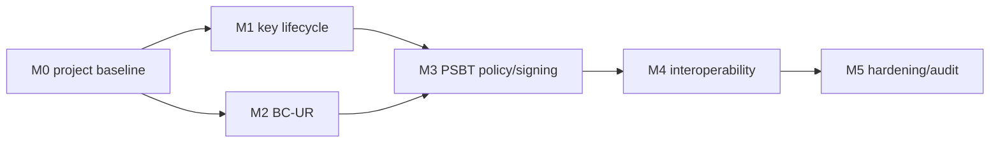

# ColdSigner v0.1 development plan

## Delivery model

Use six milestones. Estimates are ideal engineering days for one experienced Swift/Bitcoin developer and exclude external audit time. Security-critical tasks require a second reviewer.

GitHub Project fields:

- `Status`: Backlog / Ready / In progress / Review / Blocked / Done
- `Priority`: P0 / P1 / P2
- `Area`: Product / UI / Key lifecycle / Bitcoin / QR / Security / Interop / Release
- `Milestone`: M0–M5
- `Risk`: Normal / Security-critical / Compatibility-critical
- `Size`: 0.5d / 1d / 2d / 3d / 5d+

## M0 — repository and architecture baseline

Exit: generated app builds, CI runs, network guard passes, ADRs accepted.

| ID | Task | Size | Depends on | Acceptance |
|---|---|---:|---|---|
| CS-001 | Generate Xcode project and verify simulator build | 1d | — | Clean clone → `make bootstrap` → build |
| CS-002 | Establish app/core/feature module boundaries | 1d | CS-001 | UI cannot access storage or signing implementation directly |
| CS-003 | Pin BDK Swift and URKit; record provenance | 1d | CS-001 | Exact versions resolve; licenses inventoried |
| CS-004 | CI: build, tests, banned-network scan | 2d | CS-001 | Required checks run on PR |
| CS-005 | Define domain errors and redacted diagnostics | 1d | CS-002 | Snapshot tests contain no forbidden data |
| CS-006 | Create deterministic public test-fixture policy | 0.5d | — | Fixture template merged |

## M1 — key lifecycle and onboarding

Exit: test wallet can be created/restored, encrypted, locked, exported publicly, and wiped.

| ID | Task | Size | Depends on | Acceptance |
|---|---|---:|---|---|
| CS-101 | First-run security boundary and readiness checklist | 2d | CS-002 | Copy matches PRD; unverifiable items labeled |
| CS-102 | BIP39 create flow (12/24 words) | 3d | CS-003 | Official vectors; no copy/share/log |
| CS-103 | Backup challenge flow | 2d | CS-102 | Random positions; retry behavior tested |
| CS-104 | Local BIP39 restore keyboard and checksum | 3d | CS-003 | No paste/prediction; invalid checksum blocked |
| CS-105 | BIP84 wallet profile and fingerprint | 3d | CS-102, CS-104 | Descriptor/address matches reference vectors |
| CS-106 | Encrypted seed store + Keychain access control | 5d | CS-005 | ThisDeviceOnly, backup excluded, failure closed |
| CS-107 | Lock/foreground/timeout state machine | 3d | CS-106 | Background cancels session; privacy cover verified |
| CS-108 | Public descriptor/xpub export | 3d | CS-105 | No private data; Sparrow first address matches |
| CS-109 | Authenticated wipe | 2d | CS-106 | All local signer state removed; first launch returns |

## M2 — BC-UR optical transport

Exit: generic PSBT bytes survive animated QR round trips under camera and fragment disorder.

| ID | Task | Size | Depends on | Acceptance |
|---|---|---:|---|---|
| CS-201 | Define QR transport limits and error codes | 1d | CS-005 | Values centralized and unit-tested |
| CS-202 | UR `crypto-psbt` encoder | 3d | CS-003, CS-201 | Golden vectors match reference implementation |
| CS-203 | Multipart UR decoder state machine | 4d | CS-003, CS-201 | Duplicate/out-of-order/loss cases pass |
| CS-204 | Camera scanner and permission states | 3d | CS-203 | No frame persistence; denial recovery works |
| CS-205 | Animated QR player and controls | 3d | CS-202 | 2/5/10 fps and brightness behavior device-tested |
| CS-206 | UR fuzz/property corpus | 4d | CS-203 | Malformed/oversized inputs fail within resource bounds |

## M3 — PSBT validation, review, and signing

Exit: all P0 transaction policies are enforced and test vectors sign deterministically.

| ID | Task | Size | Depends on | Acceptance |
|---|---|---:|---|---|
| CS-301 | PSBT v0 normalized domain model | 4d | CS-003 | Parser output independent of UI/library types |
| CS-302 | Input ownership proof | 5d | CS-105, CS-301 | Origin/key/script/UTXO match required |
| CS-303 | Output classification and change proof | 5d | CS-105, CS-301 | Every output exactly recipient or verified change |
| CS-304 | Amount, fee, vsize/fee-rate calculation | 4d | CS-301 | Matches Bitcoin Core/BDK reference vectors |
| CS-305 | Allowlist policy engine | 4d | CS-302–304 | Unsupported inputs fail with stable code |
| CS-306 | Review commitment / mutation defense | 2d | CS-305 | Any post-review mutation invalidates approval |
| CS-307 | Transaction review UI | 4d | CS-303–305 | All outputs visible; accessibility snapshots pass |
| CS-308 | Hold/auth/sign orchestration | 4d | CS-106, CS-306 | Revalidates then signs only owned inputs |
| CS-309 | Signed PSBT export and session cleanup | 2d | CS-202, CS-308 | Coordinator can finalize; state clears on all exits |
| CS-310 | PSBT adversarial corpus and fuzz harness | 5d | CS-305 | Negative matrix passes; no crash/hang |

## M4 — interoperability

Exit: Sparrow is Supported; BlueWallet and Nunchuk have evidence-based status.

| ID | Task | Size | Depends on | Acceptance |
|---|---|---:|---|---|
| CS-401 | Sparrow pairing guide and fixtures | 3d | M1 | Fingerprint + first addresses match |
| CS-402 | Sparrow 12-scenario round trip | 5d | M2, M3 | Compatibility matrix recorded |
| CS-403 | BlueWallet import/PSBT capability spike | 3d | M2, M3 | Exact live format/version documented |
| CS-404 | BlueWallet fixtures or explicit limitation | 3d | CS-403 | Claim matches evidence |
| CS-405 | Nunchuk import/PSBT capability spike | 3d | M2, M3 | Exact live format/version documented |
| CS-406 | Nunchuk fixtures or explicit limitation | 3d | CS-405 | Claim matches evidence |
| CS-407 | BBQr PSBT transport and format-locked UI | 4d | M2, CS-405 | H/2/Z vectors pass; signed result echoes input family |
| CS-408 | Second-tester reproduction | 2d | CS-402, CS-404, CS-406 | Signed record by independent tester |

## M5 — hardening and testnet alpha

Exit: release checklist complete and no unresolved critical/high findings.

| ID | Task | Size | Depends on | Acceptance |
|---|---|---:|---|---|
| CS-501 | Oldest-device performance and memory profile | 3d | M3 | Limits confirmed or adjusted |
| CS-502 | App lifecycle/privacy/capture device tests | 3d | M1, M3 | Background, timeout, screenshot warnings pass |
| CS-503 | Final entitlements and linked-framework audit | 2d | M4 | No network/cloud capability found |
| CS-504 | Dependency/license/SBOM review | 2d | M4 | Versions, hashes, licenses published |
| CS-505 | Testnet/signing soak (50 round trips) | 5d | M4 | No unexplained mismatch or data retention |
| CS-506 | External security/Bitcoin review | external | M4 | Findings triaged; critical/high resolved |
| CS-507 | v0.1 threat model and user guide freeze | 2d | CS-506 | Docs match shipped behavior |
| CS-508 | Tag and checksum testnet alpha | 1d | all | Signed tag, artifacts, known limitations |

## Critical path

Expected implementation effort before external review: roughly 95–120 ideal engineering days for one developer. Calendar time should include review, device testing, upstream integration failures, and security rework; a credible solo v0.1 is a multi-month project, not a weekend MVP.

## Definition of done for every P0 issue

- Acceptance criteria and threat impact stated.
- Unit/integration tests cover success and at least one adversarial failure.
- No weaker fallback on errors.
- User copy reviewed for accurate security claims.
- `make check` and CI pass.
- Security-critical changes receive a second review.
- Documentation and compatibility fixture updated when behavior changes.
