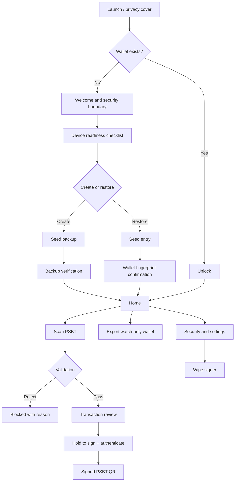

# User flows and screen map

## Information architecture

## Navigation model

ColdSigner does not use a conventional tab bar. Home is a task launcher with one primary action. Sensitive operations are linear, modal flows; the user cannot jump from seed display to scanner or from review to settings.

Back navigation always clears sensitive flow state. Backgrounding immediately places a privacy cover over the UI and cancels active signing authentication.

## Screen inventory

| ID | Screen | Purpose | Primary action | Security behavior |
|---|---|---|---|---|
| S00 | Privacy cover | Hide content in app switcher | Unlock | Appears on background |
| S01 | Welcome | Explain product and non-claims | Prepare this iPhone | No wallet operation |
| S02 | Readiness | Confirm passcode, backup method, radios off | Continue | Blocks if owner auth unavailable |
| S03 | Setup choice | Create or restore | Select path | Destructive restore warning |
| S04 | Seed display | Show 12/24 words once | I wrote it down | No copy/share; capture warning |
| S05 | Seed verification | Challenge random word positions | Verify | Rate-limited local attempts |
| S06 | Seed restore | Enter BIP39 words | Validate | Local keyboard, no paste |
| S07 | Wallet confirmation | Show fingerprint/path/network | Activate | Requires explicit match confirmation |
| S10 | Unlock | Authenticate local user | Unlock | No fallback weaker than device policy |
| S11 | Home | Start signing/export/security | Scan transaction | No balance or network status |
| S12 | QR scanner | Reconstruct animated BC-UR or BBQr PSBT | Cancel | Locks one format; size/time limits; clears partial state |
| S13 | Scan validation | Parse and apply policy | Continue if valid | No partial signing |
| S14 | Transaction review | Display all effects | Review details | Recipients never collapsed |
| S15 | Technical details | Inputs, outputs, paths, locktime | Back to review | Addresses can be revealed, not copied |
| S16 | Sign confirmation | Final deliberate action | Hold to sign | Revalidate digest, then authenticate |
| S17 | Signed QR | Return signed PSBT | Done | Auto-clears; no “broadcast” claim |
| S20 | Export format | Choose coordinator/profile | Show export | Only public material |
| S21 | Public wallet QR | Pair coordinator | Done | Fingerprint always visible |
| S30 | Security | Lock timeout, device checks, wipe | Select setting | No secret display |
| S31 | Wipe | Destroy local signer state | Type WIPE | Authenticate and double-confirm |
| S32 | About | Build, dependencies, licenses | View details | Offline static content |

## Transaction review hierarchy

The review screen is ordered by loss impact, not protocol structure:

1. **You send** — total value leaving wallet, in BTC and sats.
2. **Recipients** — every non-change output, each address and amount; no hidden “+ N outputs.”
3. **Warnings** — high fee, many outputs, non-default locktime, unknown ownership, or other policy notices.
4. **Miner fee** — absolute sats and sat/vB when computable.
5. **Change** — amount, shortened address, and verified derivation path.
6. **Technical details** — input/output count, version, locktime, PSBT digest, wallet fingerprint.

The app has no fiat conversion because it has no trusted price source offline.

## Critical interaction rules

- **Hold to sign** lasts 1.5 seconds and resets if the finger leaves the target.
- Device-owner authentication occurs after hold completion, not as a substitute for review.
- A transaction mutation, app background, timeout, or wallet lock invalidates the review approval.
- Signed QR playback offers brightness and frame-rate controls but no raw export/share sheet.
- QR scan progress is probabilistic for fountain BC-UR and exact for BBQr; label the target accordingly and never show a false exact fountain countdown.
- Destructive actions are visually separated from routine settings.

## First-run readiness checklist

The user must acknowledge:

- the iPhone has been erased or intentionally prepared;
- a device passcode is enabled;
- Wi‑Fi, Bluetooth, cellular/eSIM, AirDrop, and personal hotspot are disabled for the intended operating mode;
- the seed will be backed up on a non-digital medium;
- ColdSigner is software on a general-purpose device and cannot defend against a compromised OS;
- the first transactions will use testnet or a low-value mainnet rehearsal.

The app can inspect only some conditions. Items it cannot verify must be labeled “user confirmed,” not “verified.”
